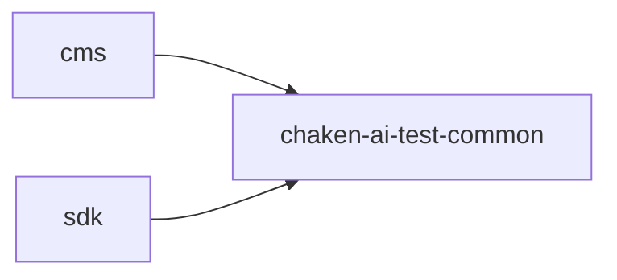

# 模块地图

## 模块职责

| 模块 | 类型 | 职责 | 禁止放入 |
| --- | --- | --- | --- |
| `chaken-ai-test-common` | 公共基础设施 | `ApiResult`、`PageResult`、错误码、异常映射、trace、安全契约、纯工具 | controller、业务 service、mapper、entity、运行时业务流程 |
| `chaken-ai-test-cms-api` | 可部署 HTTP 入口 | CMS/后台管理接口、开发级登录/token、后台认证鉴权适配、操作日志/登录日志查询、后台操作审计落库、CMS 业务 service、CMS mapper/entity/repository | SDK 开放平台契约 |
| `chaken-ai-test-sdk-api` | 可部署 HTTP 入口 | 对外 SDK/API 接口、签名、防重放、开放平台错误映射、SDK 业务 service、SDK mapper/entity/repository | CMS 页面接口和后台 DTO |

## 依赖方向

## 可部署模块

- `chaken-ai-test-cms-api`
- `chaken-ai-test-sdk-api`

`common` 是库模块，不生成独立可执行服务。默认不生成 `core` 模块；只有确认存在稳定共享业务能力时，才新增独立业务库模块。
